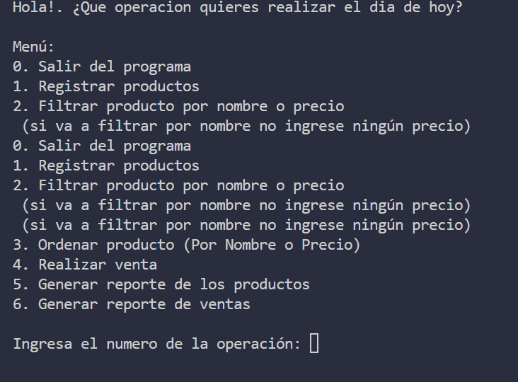

# Sistema de Gestión de Tienda en Python


## Descripción
Proyecto que gestiona productos y ventas usando:
- Funciones con `*args` y `**kwargs`.
- Manejo de errores con `try-except-else`.
- Módulos personalizados.

## 📦 Instalación
1. Clona el repositorio:
   ```bash
   git clone https://github.com/anthony88-55/sistema-gesti-n-de-tienda-con-Python

2. Ejecuta el archivo main.py


3. Menú del programa:



